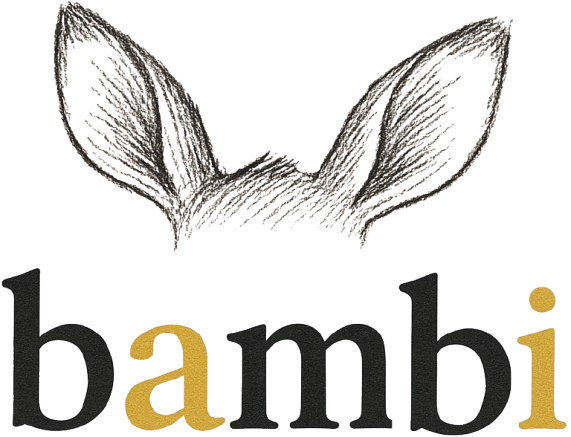

<p align="center">
  
</p>

<p align="center">
  A personal AI assistant that knows about Ofer’s life. <br>
  It uses RAG (Retrieval Augmented Generation) over my data, to answer questions, with a Streamlit frontend and a Cohere-powered backend.
</p>

I designed and built this project end‑to‑end, wearing multiple hats 🎩 across the stack:

- **Backend engineering**: Built the chat orchestration layer (intent routing, conversational memory, LLM integration) and exposed cohesive chat/KB APIs.
- **Data engineering**: Standardized document schemas/metadata, chunking configs, and ingestion paths.
- **Machine learning / LLM & prompt engineering**: Authored system prompts, tuned temps/lengths, added intent classification and safe fallbacks/timeouts.
- **Retrieval/RAG engineering**: Implemented retrieval over a vector store, optional neural reranking, and strict context/token budgets.
- **DevOps & infrastructure**: Dockerfile + `docker-compose.yml`, environment config via `.env`, reproducible local setup.
- **MLOps & observability**: Added structured logs for RAG docs, intents, and Cohere requests.
- **Frontend engineering**: Implemented Streamlit UI, session state, and streaming rendering.
- **Product management**: Defined scope, north-star use cases, and MVP; prioritized RAG-first answers and streaming UX.
- **UX/UI design**: Designed a single-page chat layout, message streaming, and context debug views.
- **QA/testing & CI**: Smoke-tested flows locally, added error handling, timeouts, and graceful fallbacks to avoid UI stalls.

## Features
- __RAG over personal data__: Vector search via ChromaDB with Cohere embeddings.
- __Chat with memory__: Conversation summary memory using LangChain and Cohere (`backend/chatbot.py`).
- __Photo metadata ingestion__: Extract EXIF/location metadata for photos (`backend/utils/photo_processor.py`).
- __S3 sync (optional)__: Pull embeddings from S3 on-demand from the UI or at startup.
- __Streamlit UI__: Modern single-page chat interface (`frontend/app.py`).
- __Docker support__: Reproducible container build and `docker-compose` for local run.
- __PDF ingestion & summarization__: Currently not supported (planned). Existing utilities like `backend/utils/pdf_processor.py` are not wired in the UI.

## Architecture
- __Frontend__: Streamlit app in `frontend/app.py` (port 8501 by default).
- __Backend / Core__:
  - `backend/chatbot.py`: `OferGPT` chat flow, intent detection, Cohere generation, RAG context assembly.
  - `backend/rag_system.py`: ChromaDB vector store, Cohere embeddings, chunking, dedupe, CSV dumps.
  - `backend/utils/pdf_processor.py`: Provided for future use; PDF ingestion is currently not supported.
  - Additional utils for photos, S3 sync, ingestion helpers under `backend/utils/` and `backend/`.
- __Data__: Embeddings and uploads in `data/` (created at runtime).


## Requirements
- Python 3.11+
- Cohere API keys
- (Optional) AWS S3 credentials (or S3-compatible endpoint) for embedding sync

Install dependencies locally:
```bash
pip install -r requirements.txt
```

Dockerized runtime uses `requirements-base.txt` and `requirements-app.txt` for faster builds.


## Environment variables
Create a `.env` at project root. Relevant variables used across the codebase:

- __Cohere__
  - `COHERE_API_KEY_EMBED` — required for embeddings
  - `COHERE_API_KEY_CHAT` — required for chat/summarization
  - `COHERE_CHAT_MODEL` — default `command-a-vision-07-2025` (see `backend/chatbot.py` / PDF summarizer)

- __RAG / Chroma__
  - `OFERGPT_RAG_TOP_K` — default 5
  - `OFERGPT_RAG_MAX_DOCS` — default 5
  - `OFERGPT_RAG_CONTEXT_CHAR_BUDGET` — default 3500
  - `OFERGPT_RAG_PER_DOC_CHAR_CAP` — default 900
  - `OFERGPT_RAG_CHUNK_SIZE` — default 1500
  - `OFERGPT_RAG_CHUNK_OVERLAP` — default 250
  - `OFERGPT_RERANK` — `1` to enable Cohere Rerank
  - `OFERGPT_RERANK_TOP_K`, `OFERGPT_RERANK_MODEL` — rerank tuning
  - `OFERGPT_RAG_TIMEOUT_SEC` — RAG retrieval timeout (default 20s)

- __Chat / Memory__
  - `OFERGPT_MEMORY_CHAR_BUDGET` — default 700
  - `OFERGPT_COHERE_TIMEOUT_SEC` — Cohere generate timeout (default 25s)
  - `OFERGPT_INTENT_TIMEOUT_SEC` — intent classifier timeout (default 5s)

- __PDF summarization__ (see `backend/utils/pdf_processor.py`)
  - `PDF_SUMMARY_MODE` — `summarize|chat|off` (default `summarize`)
  - `PDF_SUMMARY_CHUNK_SIZE` — default 4000
  - `PDF_SUMMARY_CHUNK_OVERLAP` — default 200
  - `PDF_SUMMARY_MAX_CHARS` — default 120000
  - `PDF_SUMMARY_ENABLE_REDUCE` — `1` to enable final reduce pass

- __UI / Frontend__
  - `OFERGPT_HIDE_SIDEBAR` — `1` to hide sidebar

- __S3 sync (optional)__
  - `S3_BUCKET`, `S3_PREFIX`, `S3_REGION`
  - `AWS_ACCESS_KEY_ID`, `AWS_SECRET_ACCESS_KEY`, `AWS_SESSION_TOKEN` (if needed)
  - `S3_ENDPOINT` (or legacy `S3_ENDPOINT_URL`)
  - `OFERGPT_S3_SYNC_ON_START` — `1` to pull embeddings on server start

- __Other__
  - `GOOGLE_APPLICATION_CREDENTIALS` — path to Google Vision credentials if used by other utils
  - `PROJECT_ROOT` — optional; used in CSV dump path logic`


## Project layout
```
.
├─ backend/
│  ├─ chatbot.py               # Chat orchestration (Cohere + memory + RAG)
│  ├─ rag_system.py            # Chroma vector store + embeddings + ingestion
│  └─ utils/                   # PDF/photo/S3 and helpers
├─ frontend/
│  ├─ app.py                   # Streamlit UI entry
│  └─ assets/                  # Images/icons (optional)
├─ data/
│  ├─ embeddings/              # ChromaDB persistent store
│  └─ uploads/                 # photos/, pdfs/, csv/, json/
├─ docker-compose.yml
├─ Dockerfile
├─ requirements.txt
└─ .streamlit/config.toml
```


## Running locally
1) Prepare `.env` with required keys.
2) Install dependencies:
```bash
pip install -r requirements.txt
```
3) Start the app:
```bash
streamlit run frontend/app.py --server.port=8501 --server.address=0.0.0.0
```
4) Open http://localhost:8501

Data folders will be created under `data/` on first run.


## Running with Docker
Build and run via Docker Compose (recommended):
```bash
docker compose up --build
```
- Binds port `8501:8501`.
- Mounts project, `data/`, `.env`, into the container.
- Honors environment knobs in `docker-compose.yml` (PDF summary tuning, UI flags, etc.).

Or build the image directly:
```bash
docker build -t bambi:latest .
docker run --rm -p 8501:8501 --env-file .env -v %cd%/data:/app/data bambi:latest
```


## Data ingestion
- __Photos__: Place image files under `data/uploads/photos/`. On startup or via utilities, new photos are embedded and their original files may be deleted after processing (see `RAGSystem.auto_sync_photos_from_disk`).
- __PDFs__: Not supported in the current build.
- __Instagram / CSV__: Instagram ingestion is not supported in the current build. CSV helpers may exist but are not wired into the UI.
- __Manual ingestion__: Programmatically call `RAGSystem.add_document_descriptions()` and friends to add custom content.

The Chroma store is persisted in `data/embeddings/`. A CSV snapshot `data/embeddings_dump.csv` is also produced for inspection.


## S3 synchronization (optional)
- Sidebar button “Sync from S3” calls `sync_s3_prefix_to_dir()` to pull embeddings into `./data/embeddings`.
- To auto-sync on server start, set `OFERGPT_S3_SYNC_ON_START=1` and provide S3 credentials.


## Testing
Run tests (if present):
```bash
pytest -q
```


## Troubleshooting
- __No answers or empty context__: Ensure `COHERE_API_KEY_EMBED` and `COHERE_API_KEY_CHAT` are set, and that `data/embeddings/` contains vectors.
- __Chroma telemetry__: Telemetry is disabled at runtime in `backend/rag_system.py`.
- __Large PDFs slow__: Tune `PDF_SUMMARY_*` envs to reduce API calls (larger chunks, fewer overlaps, lower cap).
- __Sidebar hidden__: Unset `OFERGPT_HIDE_SIDEBAR` or set it to `0`.
- __Port in use__: Change `--server.port` or update `docker-compose.yml` mapping.


## Acknowledgements
- Streamlit, LangChain, Cohere, ChromaDB.
